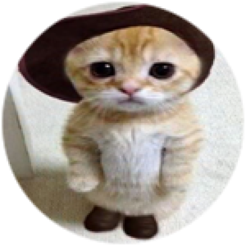

## Hello there, my fellow Alfbuddy! 💖

You've made it—great job! Now, here's the scoop: this markdown file is your **canvas**. Customize it; let your creativity flow!

Remember, you're free to add your personal touch, but keep the sacred requirements intact; they are the guardians of order here. This markdown file should include:

🚀 https://www.figma.com/file/cwHD4bAUeJy6E3C7Ld8qh0/Week-1%3A-Low-Fidelity-Layout-(Community)?type=design&node-id=0%3A1&mode=design&t=x5w5MT1rsjLHWmjP-1
🚀 
