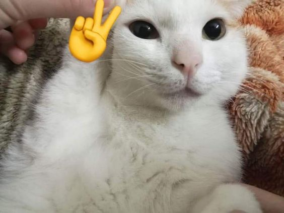

## Hello there, my fellow Alfbuddy! 💖

Superb! Your **dedication** has brought you to this **extraordinary** level, surpassing expectations and excelling in a way that truly stands out. Now, here's the scoop: this markdown file is your **canvas**. Customize it; let your creativity flow!

Remember, you're free to add your personal touch, but keep the sacred requirements intact; they are the guardians of order here. This markdown file should include:
- Link to your own figma file for WEEK 4  [hi-fi of Alfbuddy's mobile layout]:
🚀 [https://www.figma.com/file/RrtcEjP7M5GA4I3Fbzty9v/Week-4%3A-Mobile-Hi-FI-Wireframe-(Community)?type=design&node-id=1%3A81&mode=design&t=Kj6Hd4pe3yOiU4I9-1]
 
- 
 
🚀Figma workshop was a blast! ^^ Big thanks for the opportunity - I definitely learned a lot about design concepts!